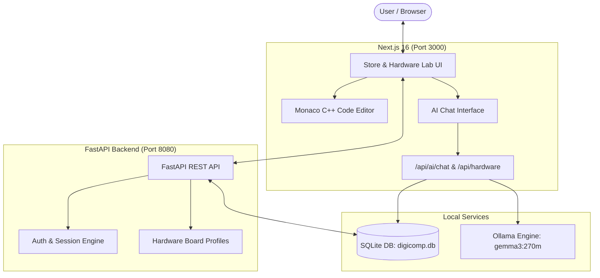

# ⚡ WebBrowserIDE — DigiComp AI & Hardware Code Lab

<div align="center">

[](https://nextjs.org/)
[](https://react.dev/)
[](https://fastapi.tiangolo.com/)
[](https://python.org/)
[](https://ollama.ai/)
[](https://microsoft.github.io/monaco-editor/)
[](https://tailwindcss.com/)
[](LICENSE)

<br/>

**A Next-Generation Web Platform Combining an In-Browser Hardware IDE (Monaco Editor) with an AI Electronics Shopping & Engineering Assistant powered by Local LLMs.**

[Explore Features](#-key-features) • [Quick Start](#-quick-start) • [Architecture](#-architecture) • [Hardware Lab](#-hardware-code-lab-in-browser-ide) • [Author Bio](#-about-the-developer)

</div>

---

## 👨‍💻 About the Developer

<table align="center" width="100%">
  <tr>
    <td width="160" align="center" valign="middle">
      <a href="https://github.com/MANOJHEGDE77">
        
      </a>
      <br/>
      <b>Manoj M Hegde</b>
    </td>
    <td valign="middle">
      <h3>👋 Hi, I'm Manoj M Hegde</h3>
      <p>
        I'm a <b>Computer Science & Data Science undergraduate</b> interested in <b>Java backend development, problem solving, and building practical software projects</b>.
      </p>
      <h4>💻 Currently Learning</h4>
      <ul>
        <li>☕ Java & Object-Oriented Programming</li>
        <li>🧠 Data Structures & Algorithms</li>
        <li>🌱 Spring Boot & REST APIs</li>
        <li>🔐 Spring Security</li>
        <li>🗄️ MySQL, PostgreSQL & MongoDB</li>
        <li>🐍 Python</li>
        <li>🤖 Generative AI & AI-powered applications</li>
        <li>🐳 Docker & backend deployment</li>
      </ul>
      <h4>🛠️ Technologies</h4>
      <p>
        <b>Languages:</b> Java, Python, SQL<br/>
        <b>Backend:</b> Spring Boot, REST APIs<br/>
        <b>Databases:</b> MySQL, PostgreSQL, MongoDB<br/>
        <b>Tools:</b> Git, GitHub, IntelliJ IDEA, VS Code, Docker
      </p>
      <p>
        🚀 <i>I enjoy building projects, learning by solving problems, and continuously improving my programming and backend development skills.</i><br/>
        📚 <i>Currently focused on strengthening my <b>Java, DSA, backend development, and problem-solving skills</b>.</i>
      </p>
      <blockquote><b>Learn. Build. Solve. Improve. 🚀</b></blockquote>
      <p>
        🌐 <b>GitHub:</b> <a href="https://github.com/MANOJHEGDE77">@MANOJHEGDE77</a> &nbsp;|&nbsp;
        📫 <b>Email:</b> <a href="mailto:kannimmhegde123@gmail.com">kannimmhegde123@gmail.com</a>
      </p>
    </td>
  </tr>
</table>

---

## 📖 Table of Contents

- [Overview](#-overview)
- [Key Features](#-key-features)
  - [1. Hardware Code Lab (In-Browser IDE)](#1-hardware-code-lab-in-browser-ide)
  - [2. DigiComp AI Shopping & Project Assistant](#2-digicomp-ai-shopping--project-assistant)
  - [3. Interactive Component Catalog & Store](#3-interactive-component-catalog--store)
  - [4. Authentication & Chat Persistence](#4-authentication--chat-persistence)
- [Architecture](#-architecture)
- [Supported Microcontrollers](#-supported-microcontrollers)
- [Quick Start](#-quick-start)
  - [Prerequisites](#prerequisites)
  - [1. Ollama & AI Setup](#1-ollama--ai-setup)
  - [2. Backend Setup (FastAPI)](#2-backend-setup-fastapi)
  - [3. Frontend Setup (Next.js)](#3-frontend-setup-nextjs)
- [Repository Structure](#-repository-structure)
- [Demo AI Prompts](#-demo-ai-prompts)
- [Contributing & License](#-license)

---

## 🌟 Overview

**WebBrowserIDE** brings the power of desktop IDEs and AI engineering assistance straight to the web browser:

1. **Hardware Code Lab**: An in-browser IDE powered by VS Code's **Monaco Editor**, enabling engineers to write, edit, format, and simulate C++ firmware for popular microcontrollers (Arduino Uno, Arduino Nano, and ESP32 DevKit).
2. **DigiComp AI Assistant**: An intelligent assistant using ultra-lightweight **Gemma 3 270M** (or **Qwen3**) running locally via **Ollama**. It parses user goals ("I want to build an obstacle avoiding robot under ₹1000") and executes deterministic function-calling against a local SQLite product catalog to deliver exact bill-of-materials and product cards with zero external dependencies.

---

## ✨ Key Features

### 1. Hardware Code Lab (In-Browser IDE)
- 🖥️ **Monaco Code Editor**: Full-featured C/C++ editor with syntax highlighting, line numbers, bracket matching, and auto-indentation.
- 🎯 **Board Selection**: Instant switching between **Arduino Uno R3**, **Arduino Nano**, and **ESP32 DevKit V1**.
- ⚡ **Sketch Templates**: Pre-loaded starter templates for **Blink**, **WiFi Network Scanner**, and **Analog Sensor Telemetry**.
- 📡 **Simulated Serial Monitor**: Real-time serial monitor with timestamped diagnostic output and selectable baud rates (9600, 115200, etc.).
- 🛠️ **Syntax Verification**: In-browser compiler simulation reporting memory usage (Flash/SRAM) and compilation status.

### 2. DigiComp AI Shopping & Project Assistant
- 🧠 **Local LLM Execution**: Powered by Ollama (`gemma3:270m` by default for sub-second responses; fallback to `qwen3:1.7b` / `qwen3:4b`).
- 🔍 **Autonomous Function Calling**: The model calls `search_digicomp_products(query, max_price)` to pull real items from the SQLite database.
- 💰 **Budget Constraints**: Under-the-hood price parser handles queries like *"ESP32 under ₹500"* or *"motor driver below ₹300"*.
- 🧹 **Zero Hallucination Filter**: All product specifications, prices, and stock numbers come directly from SQLite; no fabricated specs.
- 💬 **Conversation Management**: Multi-turn dialogue context with persistent conversation history, title generation, and conversation rename/delete.

### 3. Interactive Component Catalog & Store
- 🛒 **20+ Curated Products**: Microcontrollers, motor drivers, sensors (ultrasonic, soil moisture, DHT22), power modules, and chassis kits.
- 🎨 **Self-Contained SVG Assets**: Dynamic, self-hosted SVG product schematics—zero external image dependencies or broken CDNs.
- 🏷️ **Categorization & Filtering**: Filter by category (Microcontrollers, Sensors, Motors, Power, Automation) and price.
- 🛍️ **Shopping Cart**: Real-time client-side shopping cart with badge counters and checkout drawer.

### 4. Authentication & Chat Persistence
- 🔐 **User Accounts**: Register and sign in with secure password hashing.
- 🍪 **Session Management**: Cookie-based and token-based session verification across FastAPI and Next.js.
- 💾 **Database Backed**: Saved conversations and messages stored per user in SQLite.

---

## 🏗 Architecture



---

## 🔌 Supported Microcontrollers

| Board | MCU | Clock Speed | Flash Memory | SRAM | Operating Voltage | Default Baud |
| :--- | :--- | :--- | :--- | :--- | :--- | :--- |
| **Arduino Uno R3** | ATmega328P | 16 MHz | 32 KB | 2 KB | 5V | 9600 |
| **Arduino Nano** | ATmega328P | 16 MHz | 30 KB | 2 KB | 5V | 9600 |
| **ESP32 DevKit V1** | ESP32-D0WDQ6 | 240 MHz | 4 MB | 520 KB | 3.3V | 115200 |

---

## 🚀 Quick Start

### Prerequisites
- **Node.js**: v18.0.0 or higher
- **Python**: v3.10 or higher
- **Ollama**: [Download & install Ollama](https://ollama.ai/)

---

### 1. Ollama & AI Setup

Pull the recommended ultra-fast model (or Qwen fallback):

```bash
ollama pull gemma3:270m
```

Verify that Ollama is responding:
```bash
ollama run gemma3:270m
```

---

### 2. Backend Setup (FastAPI)

From the project root directory:

```powershell
# Optional: create and activate virtual environment
python -m venv .venv
.venv\Scripts\activate

# Install dependencies
pip install -r requirements.txt

# Run the FastAPI server on port 8080
python -m uvicorn backend.main:app --host 127.0.0.1 --port 8080 --reload
```

> **API Swagger Docs**: Visit [http://127.0.0.1:8080/docs](http://127.0.0.1:8080/docs) to test API endpoints interactively.

---

### 3. Frontend Setup (Next.js)

Open a second terminal window:

```powershell
cd frontend
npm install
npm run dev
```

Open your browser at:
👉 **[http://localhost:3000](http://localhost:3000)**

- **Store & AI Chat**: `http://localhost:3000/` and `http://localhost:3000/ai`
- **Hardware Code Lab**: `http://localhost:3000/hardware-lab`

---

## 📁 Repository Structure

```
WebBrowserIDE/
├── backend/
│   ├── __init__.py
│   ├── ai.py                   # Ollama integration & function-calling pipeline
│   ├── db.py                   # SQLite schemas, tables, and CRUD operations
│   ├── main.py                 # FastAPI REST API routes & hardware catalog
│   └── products.py             # 20 seeded electronics components
├── data/
│   └── .gitkeep                # Local SQLite database directory (auto-created)
├── frontend/
│   ├── src/
│   │   ├── app/
│   │   │   ├── ai/page.tsx             # Standalone AI Chat view
│   │   │   ├── hardware-lab/page.tsx   # Web Browser IDE with Monaco Editor
│   │   │   ├── products/               # Product details & catalog pages
│   │   │   └── api/                    # Next.js API route handlers
│   │   ├── components/                 # UI components (Header, Footer, Cards)
│   │   ├── context/                    # AuthContext and CartContext
│   │   ├── lib/                        # Client API and DB helpers
│   │   └── types/                      # TypeScript definitions (Hardware, Chat)
│   ├── public/images/products/         # Self-contained SVG hardware illustrations
│   └── package.json
├── scripts/                            # E2E test suites & latency benchmarks
├── requirements.txt                    # Python dependencies (fastapi, uvicorn, etc.)
└── README.md                           # Documentation & Developer Bio
```

---

## 💬 Demo AI Prompts

Try asking the assistant:

- 🤖 *"I want to build an obstacle avoiding robot. What components do I need?"*
- 🌱 *"Help me design a smart irrigation system with a water pump."*
- 💰 *"Find me an ESP32 board under ₹500."*
- 🌡️ *"What parts do I need for an IoT weather telemetry station?"*
- 🚗 *"I need a 12V motor driver and geared DC motor for a robot."*

---

## 🧪 Testing & Benchmarks

Run automated end-to-end tests and benchmarks:

```powershell
# Test query latency benchmark
node scripts/benchmark_latency.js

# Test end-to-end multi-turn chat pipeline
node scripts/test_end_to_end.js

# Test Python backend AI logic
python scripts/test_all_10_queries.py
```

---

## 📄 License

This project is licensed under the [MIT License](LICENSE).

---

<div align="center">
  <sub>Developed with ❤️ by <a href="https://github.com/MANOJHEGDE77">Manoj M Hegde</a></sub>
</div>
